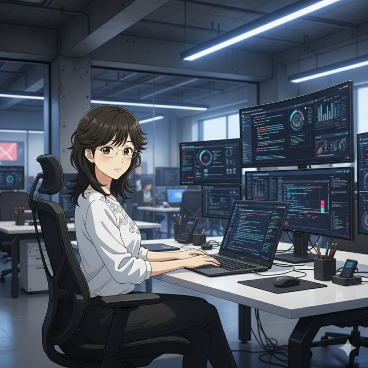

## Hi, I'm Anannya Patil

I'm currently focused on backend development, with experience in Python, C, C++, SQL, and Flask. I’ve also worked on full-stack projects and have some exposure to hardware-based systems, though my primary interest lies in building efficient, well-structured backend systems.

### Projects (team-based)
- **JEE Question Solver (C):** A terminal-based solver for basic entrance-style problems.  
- **Sports Website for Government:** Informational site built using HTML, CSS, JavaScript, and Bootstrap.  
- **Eco-friendly Textile Identifier:** Firebase-backed website with an AI chatbot to identify sustainable textile options.  
- **Mini Search Engine:** Python + Flask-based project with SQL integration for indexing and querying content.  
- **Smart Stick for the Visually Impaired:** ESP32-CAM-based model providing obstacle detection and audio feedback.  
- **Automatic Parking System:** Arduino-based model using sensors and LCD for slot availability tracking.

### Skills
- **Languages:** Python, C, C++, SQL, HTML, CSS, JavaScript  
- **Frameworks/Tools:** Flask, Bootstrap, Firebase  
- **Version Control:** Git, GitHub  
- **Hardware Experience:** Arduino, ESP32-CAM, sensors (basic level)

---

Currently building on my backend development skills, with an emphasis on clean code, database design, and application logic.

  

